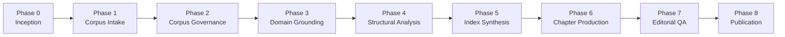
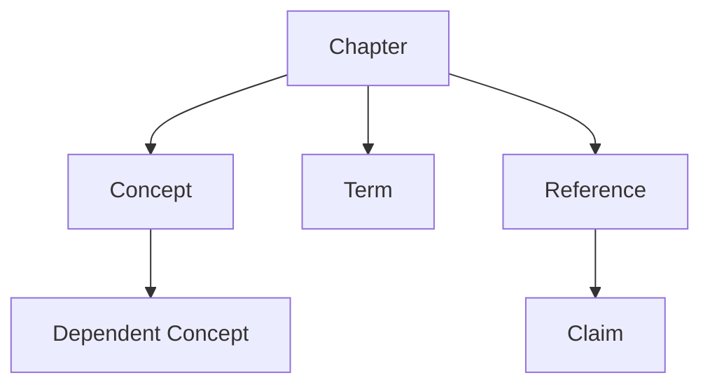

# Editorial Documentation Engineering Template


A **production-grade template repository** for building **large-scale technical documentation systems** using structured editorial workflows and AI-assisted processes.

This repository provides the foundation for creating documentation such as:

- Technical books
- Engineering manuals
- Product documentation
- Whitepapers
- Structured knowledge bases

The system is designed to support **documentation at scale (100k–1M+ tokens)** while maintaining editorial coherence through:

- structured editorial workflows
- session-based editing
- corpus governance
- an **Editorial Knowledge Graph**
- automated validation and QA

---

## Documentation Engineering Model

Traditional documentation workflows break down when:

- documentation becomes large
- multiple contributors collaborate
- AI tools are involved in writing
- conceptual consistency becomes difficult

This project introduces a **Documentation Engineering approach** combining:

- editorial governance
- structured metadata
- graph-based knowledge modeling
- reproducible editing sessions
- AI-assisted workflows

---

## Repository Architecture

```text
corpus/            knowledge sources
manuscript/        final documentation
editorial/         editorial governance
editorial-graph/   coherence engine
sessions/          AI-assisted editing sessions
scripts/           automation tooling
prompts/           prompt library
templates/         chapter templates
phases/            editorial workflow definition
docs/              documentation
```

---

## Editorial Pipeline



Each phase progressively transforms **raw knowledge into structured documentation**.

---

## Editorial Knowledge Graph

Large documentation projects require structural coherence.

The **Editorial Knowledge Graph** models relationships between:

- chapters
- concepts
- terminology
- references
- claims
- dependencies



This enables:

- duplicate detection
- prerequisite validation
- terminology consistency
- automated context generation for prompts

---

## Session-Based Editing

Documentation work is organized into **editorial sessions**.

Examples of sessions:

- chapter editing
- block review
- terminology validation
- grounding review
- QA review

Sessions ensure:

- reproducibility
- traceability
- controlled AI usage

---

## Branching Model

The repository follows a **main + develop integration model**.

```text
main
 ↑
develop
 ↑
feature/*
fix/*
docs/*
chore/*
experiment/*
```

### `main`
Stable branch representing the **publishable state**.

### `develop`
Integration branch for ongoing development.

### `feature/*`
Used for new functionality.

Examples:

```text
feature/editorial-template-structure
feature/editorial-graph
feature/session-workflow
feature/corpus-governance
```

### `experiment/*`
Used for research and exploration.

Examples:

```text
experiment/neo4j-graph
experiment/agent-editor
experiment/rag-corpus
```

---

## Intended Users

This template is designed for:

- documentation teams
- technical writers
- engineering organizations
- AI-assisted documentation workflows
- large knowledge systems

---

## Quick Start

1. Read `docs/QUICKSTART.md`
2. Review `docs/WORKFLOW.md`
3. Review `docs/SESSION-STRATEGY.md`
4. Run `./init.sh` to initialize a new project repository from the template

---

## License

MIT License. See `LICENSE`.

## Contributing

See `CONTRIBUTING.md`.

## Security

See `SECURITY.md`.

---

## Vision

This project treats documentation as an **engineering artifact** rather than static text.

The goal is to create a system where documentation can be:

- generated
- reviewed
- validated
- evolved

using structured workflows and AI-assisted processes.
